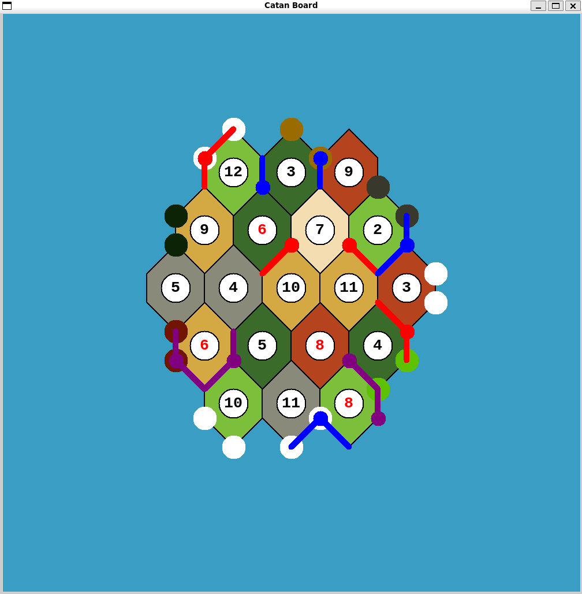

# Welcome to Optimized Catan!
Please note that this project uses [tkinter](https://docs.python.org/3/library/tkinter.html) (should come pre-installed with your Python installation, but otherwise, see the docs) and Gurobi.

To install Gurobi, run `pip install -r requirements.txt`.

To run with custom parameters (which spawns the GUI):
`python3 -m main [player_count (from 3 - 6)] [road_settlement_count (from 2 - 6)]`.

e.g.

`python3 -m main 3 4`:

To run the evaluation:
``python3 -m evaluate``

# Contact
18rldv@queensu.ca
